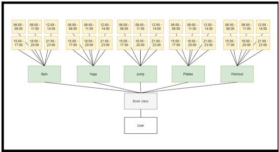
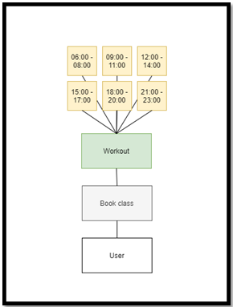
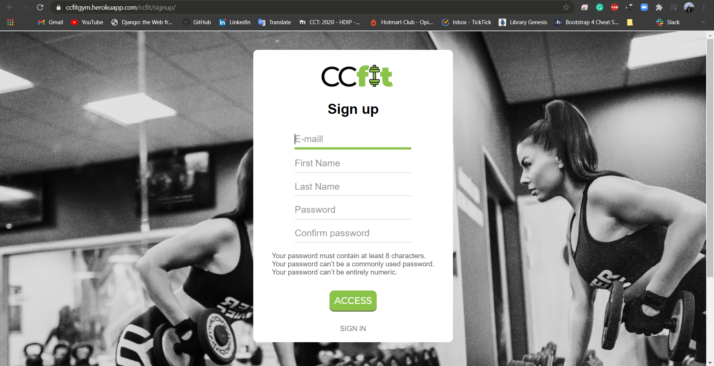
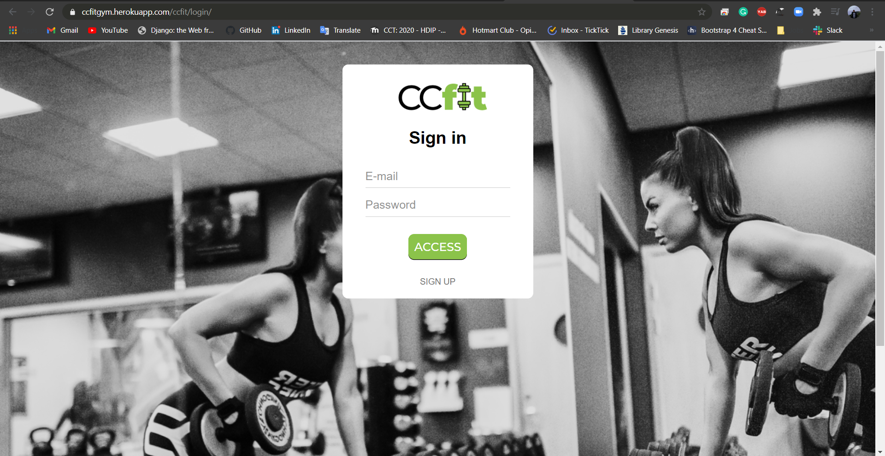
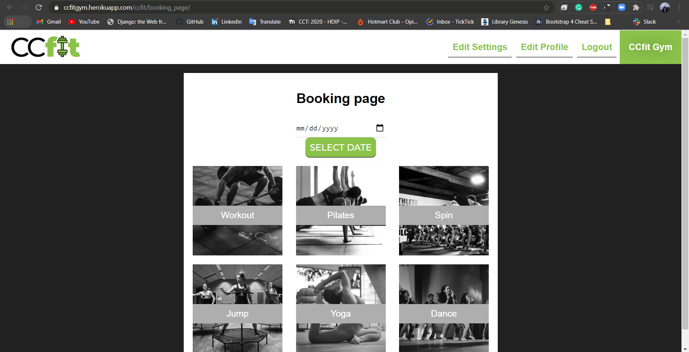
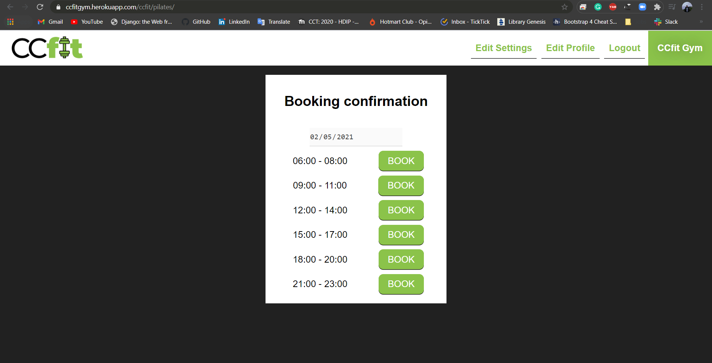
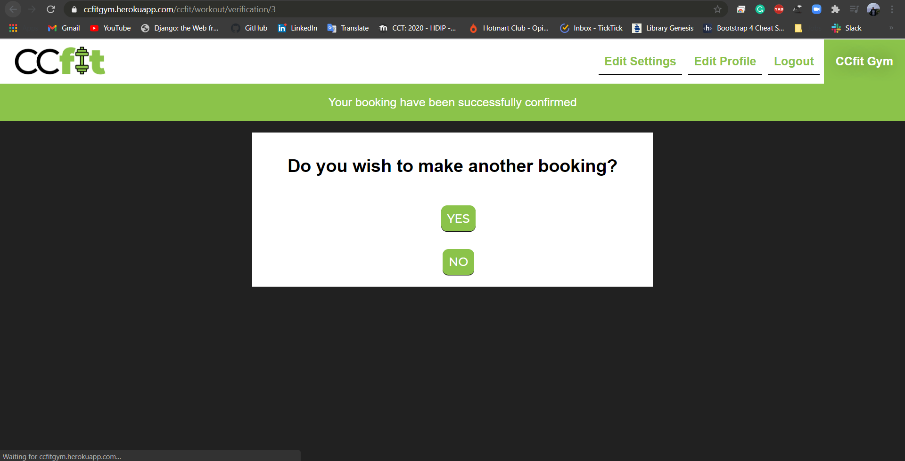

# CCfit gym
> This is a project thought and developed during the very end of the last semester of the Higher Diploma in Science Computing course at CCT College.

## Table of contents
* [What your project does](#what-your-project-does)
* [User Class Session relation](#User-Class-Session-relation)
* [Technologies used](#technologies-used)
* [Example usage](#example-usage)
* [Changelog](#changelog)
* [Roadmap](#roadmap)
* [Author info](#author-info)

## What your project does
This project provides a complex booking system that helps gyms owners to manage their establishment regarding the number of people allowed to be indoors at the same time while training, designate the instructors for each one the classes, and provide users with the experience of doing everything online, from registering to making the online payment and finally booking the slot session.

As the business had to adapt to the restriction, the gyms started to control the flow of users they have during the day and split that in sections so they can still provide their services. This project in specific is related to the creation of a web-based application for the CCfit gym which like the others, had to adapt its services.
Considering the scenario described above, here are the functionalities the system will provide for each one of the system roles:


* Manage users: Edit all the information related to the users and teachers such as personal info, role (user, teacher or admin), and the type of subscription whether it “All Classes” or “Workout Only”.
* Check classes: Check the daily schedule for each class by generating reports so the admin can designate the instructors for the classes.
* Generate Invoice: Manage and generate invoices for each user, whether if it is “Enrolment Fee” or “Monthly payment”.
* Check classes: Check the daily schedule for each class by generating reports so the admin can designate the instructors for the classes.
* My bookings: Check all the classes and workouts booked since the user joined the gym.
* Payment Enrolment fee: Redirects the user to the payment page to pay the enrolment fee.
* yment Monthly payment: Redirects the user to the payment page to pay the monthly payment.
* Edit Settings: Everyone with access to the website can edit the system settings regarding the email and password.
* Edit Profile: This section allows the user to provide the personal info and the type of subscription (Workout only or All Classes).

All tables are linked in a way that when an issue or comment is added, information like project ID and user are attached to it.

## How to set it up
Firstly clone the project running the following command
```ruby
$ git clone https://github.com/ferreirajackson/ccfit-live.git
```

Then install the dependencies used in the project you case you dont have them
```ruby
$ pip install requirements.txt
```
## User Class Session relation
The following flowchart represents the relation between class and sessions from the user view when he has both “All Classes” and “Workout Only” subscription:

All Classes:



Workout only:




## Technologies used
Frontend
* HTML (HyperTextMarkup Language);
* SAAS CSS (Cascading Style Sheets);
* Javascript.

Backend
* Python, as the programming language;
* Django, as the web framework;
* Model-View-Template (MVT) as the architectural pattern.

Database
* Relational Database (POSTGRESQL), to store the website data
* pgAdmin software to manage the data from POSTGRESQL;
* Relational Database (SQLite) for tests.

Other technologies:
* HTTP Methods;
* Heroku (PaaS platform).


## Example usage

In case it's a new user, it can be signed up by this form:


The login page for the user to have access to the system is the following:


The booking functionality which is the main is accessed with the following screen after having the data and class defined:


Then the user chooses the session:


And has its booking confirmed:


* All the functionalities of this report can be check through [this document](./readmeimages/CCFIT_REPORT.docx).


## Changelog
* 1st week of December 2020 - Proposal made and planning
* 2nd week of December 2020 - Database design
* 3rd week of December 2020 - Backend and database setup
* 4th week of December 2020 - Backend
* 1st week of January 2021 - Backend, testiing and deployment
* 2nd week of January 2021 - Frontend and backend and deployment
* 3rd week of January 2021 - Frontend and testing
* 4th week of January 2021 - Fests and documentation


## Roadmap
* Implement Dance class. (January 2021)
* Docker-ise it. (February 2021)
* Repaginate the frontend with a better frontend framework. (February 2020)

## Author info
Web developer: Jackson Ferreira dos Santos | 
College name: CCT | 
Course title: Science in computing


